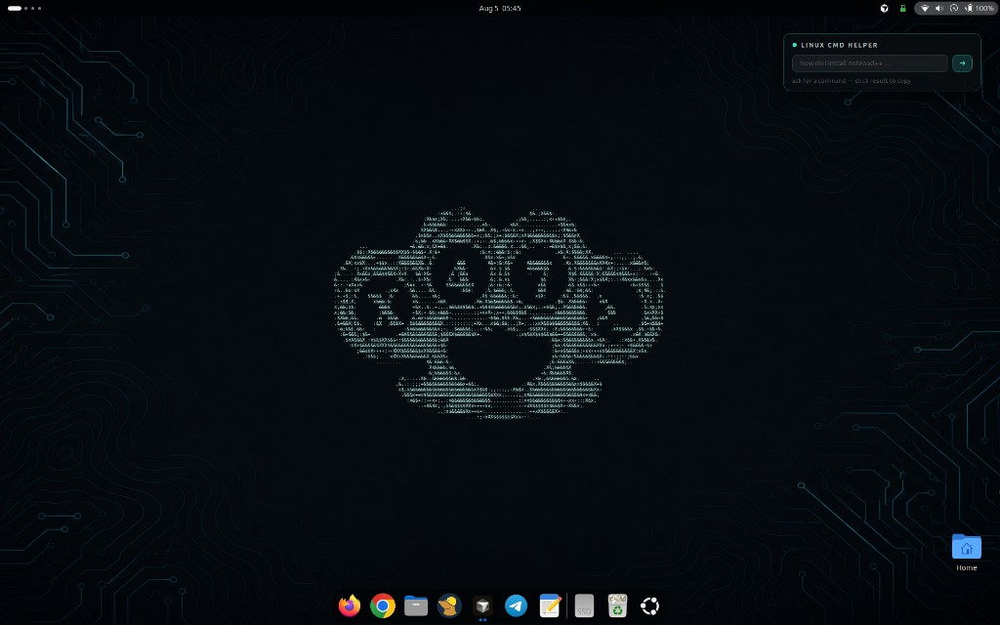
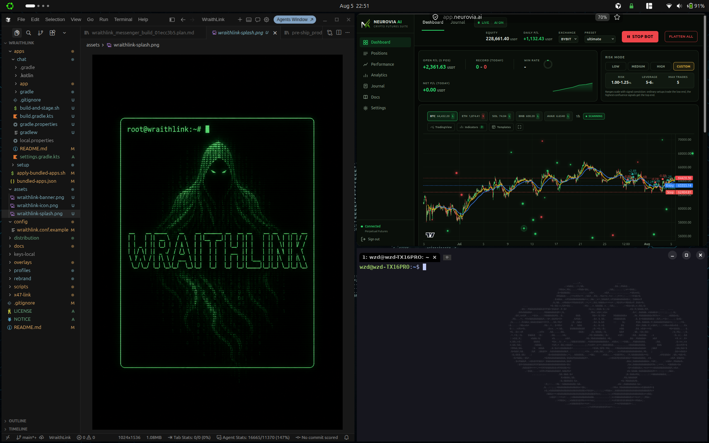

# Ubuntu X47 Build

Idempotent installer that reproduces a custom Ubuntu 24.04 / 26 desktop:

- **WezTerm** as the default terminal (compact spawn size, **X47 watermark** on the right, tab-bar chrome with always-visible Gnome-style min/max/close); GNOME Terminal is removed
- **Mullvad VPN** (apt) and **Tor Browser** (latest from Tor Project, registered in the app menu)
- **X47 PDF Editor** (`x47-pdf`) — ONLYOFFICE + PDF Arranger + Xournal++. Search “PDF” or the Office folder
- **X47 Ark** — backup Windows user files to USB, then reclaim the disk for Ubuntu
- **Claude Code** — official Anthropic CLI in Dev Tools
- Pentest + developer toolchain (apt, Go, pipx, cargo, GitHub release binaries, gems)
- Custom **app-grid launchers** and icons (`kali-*` pack, custom `kali-cool-*`, `x47duster` fallback — no Kali dragon)
- Hardened services snapshotted from the reference machine (UFW, fail2ban, AppArmor, auditd, unattended-upgrades, sysctl)

Part of the [VulnScape](https://vulnscape.net) cybersecurity suite.

**Docs site (free):** [sk1tzwzd.github.io/ubuntu-x47-build](https://sk1tzwzd.github.io/ubuntu-x47-build/) · [Releases](https://sk1tzwzd.github.io/ubuntu-x47-build/releases.html)

Windows 11 kit is a **separate project:** [X47-Win](https://sk1tzwzd.github.io/X47-Win/)  

**Support (optional):** [buymeacoffee.com/sk1tzwzd](https://buymeacoffee.com/sk1tzwzd)





## Quick start (fresh machine)

```bash
git clone https://github.com/sk1tzwzd/ubuntu-x47-build.git
cd ubuntu-x47-build
chmod +x install.sh snapshot.sh modules/*.sh
./install.sh
```

You will be prompted for sudo for apt repos/packages and hardening restore.

### Flags

| Flag | Effect |
|------|--------|
| `--user-only` | Skip apt + hardening; install terminal, tools, icons, launchers only |
| `--skip-apt` | Skip third-party repos and apt packages |
| `--skip-hardening` | Skip UFW / fail2ban / sysctl / auditd restore |
| `--skip-debloat` | Keep language packs and default desktop apps (no trimming) |
| `--skip-perf` | Skip boot/service perf tweaks and the Firefox snap→deb swap |
| `--skip-desktop-fx` | Skip tiling / wallpapers / desktop FX |
| `--desktop-mode both\|visual\|performance` | Install both stacks (default/recommended), Visual only, or Performance only |
| `--skip-putty-clipboard` | Disable PuTTY-style WezTerm clipboard (select copy / right-click paste / Ctrl+C·V) |
| `--skip-win-screenshot` | Do not bind Super+Shift+S (Print still works) |
| `--with-amnesia` | Also create the amnesiac, Tor-forced `anon` user (opt-in) |
| `--skip-syncthing` | Skip hardened Android↔PC Syncthing share |
| `--skip-claude` | Skip official Claude Code CLI + Dev Tools launcher |
| `--skip-pdf` | Skip X47 PDF (ONLYOFFICE, PDF Arranger, Xournal++, guide) |
| `--skip-ark` | Skip X47 Ark (Windows file backup + Ubuntu disk reclaim) |
| `--only 10-terminal,30-icons` | Run a subset of modules |

Optional features default **on**. Change them anytime with **X47 Settings** (`x47-settings` in the app menu, or `x47-settings list` / `set KEY on|off`).

## Performance / debloat

By default the installer trims the fat (opt out with `--skip-debloat`):

- **Language packs** — removes every non-English `language-pack-*`, LibreOffice l10n, and non-`en` spell dictionaries.
- **Default desktop apps** — removes GNOME Terminal, GNOME games, Rhythmbox, Cheese, Thunderbird, LibreOffice, Transmission, Remmina, Shotwell, Maps/Weather/Contacts/Todo, Simple Scan, Totem, GNOME Music/Photos, Ubuntu Help (`yelp`).
- **Snap bloat** — removes the App Centre (`snap-store`) and Desktop Security Centre snaps (keeps firmware-updater).
- **Cleanup** — `apt-get autoremove --purge`, cache clean, `journalctl` vacuum to 200M, thumbnail cache.
- **Tweaks** — `fstrim.timer`, `zram-config` compressed swap, `vm.swappiness=10`, and the desktop file indexer (tracker/localsearch) masked.

Everything is reversible: `sudo apt-get install <pkg>`. Core desktop/session packages and the pentest/dev toolchain are never touched. Note: zram adds compressed swap; if you want *true* amnesia in the anon session, still disable swap (see below).

## Boot / runtime performance

The `06-perf.sh` module trims boot time and idle resource use (opt out with `--skip-perf`). Every step prints how to undo it:

- **Pentest tools off the boot path** — `chkrootkit` and `bettercap` are kept but no longer run as boot services (they were adding ~60s of boot I/O). Run them on demand.
- **Faster GRUB** — menu timeout cut to 1s and hidden.
- **ModemManager masked** — no cellular modem means no serial-port probe stalls at boot.
- **ClamAV on-demand** — the resident daemon is stopped (frees ~1 GB RAM); `freshclam` still updates signatures, scan with `clamscan -r <dir>`.
- **kdump-tools disabled** — frees the reserved crash-kernel RAM.
- **cloud-init disabled** on the installed system (it is only needed at install time).
- **Printing/discovery off** — `cups`, `cups-browsed`, and `avahi` disabled (re-enable if you print).

Firefox is left as the hardened snap (the earlier snap→deb swap was removed). If you ran a build that swapped it, `scripts/firefox-restore-snap.sh` puts the snap and your profile back.

## Firefox hardening

- **Main browser** — a system-wide enterprise policy at `/etc/firefox/policies/policies.json` (honored by the Firefox snap and deb): telemetry/studies/Pocket/sponsored content off, tracking protection with cryptomining + fingerprinting blocking, HTTPS-only, DNS-over-HTTPS, no prefetch/speculative connections. JavaScript stays on for normal browsing. The installer also sets **hardened Firefox as the default browser** (over Chrome).
- **Anon browser** — Tor Browser "Safest" defaults (JS off, DoH hard-off). Firefox uses local Tor SOCKS (`127.0.0.1:9050`); other apps stay transparently torified by the UID kill-switch.

## X47 Updates

Use the **X47 Updates** app (app menu) or CLI to check and apply full apt/snap/Cursor updates in one place (Ubuntu Software Updater remains available; unattended security upgrades stay on):

```bash
x47-updates              # Zenity: Check → list → Update all
x47-updates check        # report only
x47-updates apply        # password prompt; progress in a terminal
x47-updates repair-sources   # restore Mullvad apt list if missing
```

Cursor-only shortcut (same apt repo):

```bash
update-cursor
# or: sudo apt update && sudo apt install --only-upgrade cursor
```

If the Cursor GUI says an update is available but apt says you already have the newest version, that is a **known Cursor lag** (in-app feed vs apt repo). It is not caused by X47 debloat. Wait and re-run later, or silence the nag with `update-cursor --quiet-gui`.

**Mullvad:** the VPN daemon keeps running if the tray GUI crashes. On Wayland+AMD the GUI is launched with `ELECTRON_OZONE_PLATFORM_HINT=x11`. Backup: `mullvad status` / `mullvad connect`.

## X47 Ark

**X47 Ark** copies Windows user files to an external USB, verifies the copy, then can delete Windows so Ubuntu owns the disk. The backup cannot live on the dual-boot drive. If BitLocker is on, unlock it in the app with your recovery key (no Windows boot). Fast Startup should be off if the volume is hibernated.

```bash
x47-ark              # GTK assistant (Zenity fallback)
x47-ark detect       # layout only
x47-ark backup /media/you/USB
x47-ark verify
x47-ark reclaim      # after verify; type DELETE WINDOWS
```

Typical dual-boot (Windows first) cannot move a mounted Ubuntu root. Ark writes `X47-Ark/finish-ark.sh` on the stick — boot any Ubuntu live USB and run it. Offline guide: `x47-ark guide`.

## Desktop looks

Two modes for the main user (opt out with `--skip-desktop-fx`). Installer default is **both** stacks, starting in **Performance**; switch anytime from the **PERF / VISUAL** chip on the right of the top bar (or `x47-desktop-mode`):

| Mode | What you get |
|------|----------------|
| **Performance** (default) | Lean GNOME: animations off, no cube/blur/wobbly/Coverflow/ws-walls, **no dock** (both modes), lime Show Apps in the top bar |
| **Visual** | Desktop Cube, Coverflow Alt-Tab, Blur My Shell, Burn My Windows, wobbly windows, multi-colour `x47-ws-walls`, animations on (**no dock**) |

Shared in both modes: CTRL+drag tiling, notification click-to-focus, Show Apps, mode toggle chip, display comfort panel, **no bottom dock**.

- **Display comfort** — top-bar brightness / blue-light / glare; Adaptive (Visual stack) follows time of day. Turning blue-light / Night Light off sticks until you turn Adaptive back on.
- **X47 wallpapers** — ASCII knuckle-duster circuit colourways (regen with `scripts/make-wallpaper.py --all`). Visual switches them per workspace.
- **Login screen** — GDM Ubuntu wordmark replaced with the teal ASCII duster (`scripts/make-login-logo.py` → `/usr/share/pixmaps/x47-login-duster.png`).
- **Notifications** — click a top banner once to jump to the app.
- **Anon** stays Performance-only (no heavy FX in the amnesia session).
- **Window tiling** — Tiling Shell; hold Ctrl while dragging; toggle via `x47-settings set tiling off`.
- **Screenshot** — `Super+Shift+S` or `Print` (optional via X47 Settings).
- **WezTerm (PuTTY-style)** — select copy / right-click paste / `Ctrl+C`·`V` (optional via X47 Settings).
- **Syncthing (X47 Sync)** — optional hardened LAN sync (`x47-syncthing`); default share `~/X47Share`. Top-bar **SYNC** chip (right) + app icon opens the localhost GUI.
- **X47 Updates** — check/apply apt + snap + Cursor; restores Mullvad apt source when needed.
- **Claude Code** — official Anthropic CLI + Dev Tools launcher (Claude starburst icon).
- **X47 PDF** — one app to edit / arrange / annotate PDFs (ONLYOFFICE + PDF Arranger + Xournal++) with an offline guide.
- **X47-Win** (separate repo) — Windows 11 privacy kit. Encryption is optional. If you used BitLocker, import the USB key here with `x47-windows-import-key`.
- **X47 Ark** — copy Windows user files to an external USB, verify, then delete Windows and give the disk to Ubuntu (`x47-ark`). Typical dual-boot (Windows first) finishes from a live USB.

User-level only (no sudo) for most desktop FX. On Wayland, **log out and back in** once after install so extension changes load.

> **Removed:** Linux CMD Helper / X47 Widgets desktop cards, and Nerovia Firefox widgets (stubs only). `modules/52-widgets.sh` purges leftover UUIDs and never reinstalls them.

## Install from ISO

Each release also ships a bootable installer ISO: the official Ubuntu 26.04 desktop image remastered with this build baked in (`scripts/build-iso.sh`, built by the *Build X47 ISO* GitHub Actions workflow). Pick **Install X47 Ubuntu 26.04 (custom build)** in the boot menu, install Ubuntu as normal (language, disk, and user stay interactive), and the X47 installer runs in a terminal on first login.

GitHub caps release assets at 2 GB, so the ISO is split into parts:

```bash
cat x47-ubuntu-26.04-desktop-amd64.iso.*.part > x47-ubuntu-26.04-desktop-amd64.iso
sha256sum -c SHA256SUMS --ignore-missing
```

To build it yourself: `sudo apt install xorriso`, then `./scripts/build-iso.sh` (no root needed; ~13 GB of free disk).

## What gets installed

### Terminal
- WezTerm AppImage under `~/tools/wezterm`
- Wrapper at `~/.local/bin/wezterm`
- Config: `~/.config/wezterm/wezterm.lua` (default ~1008×450; tools/VulnScape open larger via `X47_TERM_SIZE`; always-visible title-bar buttons) + watermark `~/.config/wzd/watermark.png`
- Default terminal via `xdg-terminals.list` + GNOME gsettings; GNOME Terminal purged / hidden

### Privacy
- **Mullvad VPN** via official apt repo (`mullvad-vpn` in the apt manifest); GUI launcher uses `ELECTRON_OZONE_PLATFORM_HINT=x11` on Wayland
- **Tor Browser** latest linux-x86_64 build → `~/tools/tor-browser`, registered with `--register-app`, CLI symlink `~/.local/bin/tor-browser`
- **Syncthing (Android ↔ PC)** — official binary, LAN-first hardening (no cloud, no relays, no global discovery, GUI on `127.0.0.1` + password). Share folder `~/X47Share`. Helper: `x47-syncthing`. Skip with `--skip-syncthing`. Prefer F-Droid Syncthing on Android; approve devices manually.
- **X47 Updates** — `x47-updates` (+ desktop entry) for full apt/snap/Cursor upgrades; restores Mullvad apt source if dropped
- **X47-Win** — separate Windows 11 kit: [sk1tzwzd.github.io/X47-Win](https://sk1tzwzd.github.io/X47-Win/). Encryption is optional (BitLocker or VeraCrypt). If BitLocker is on, import the USB key on Ubuntu with `x47-windows-import-key`.

### Tools (high level)
- **apt**: nmap, metasploit-framework, wireshark, hashcat, hydra, sqlmap, docker-ce, golang-go, ruby-dev, mullvad-vpn, ufw, fail2ban, …
- **Go**: amass, subfinder, httpx, nuclei, katana, naabu, dnsx, chisel, ligolo-ng, …
- **pipx**: netexec, impacket, bloodhound-python, smbmap, enum4linux-ng, arjun, wafw00f, …
- **cargo**: bat, feroxbuster
- **release bins**: rustscan, gitleaks, trufflehog, eza, fd, zoxide, delta
- **Claude Code**: official Anthropic CLI (`~/.local/bin/claude`) + Dev Tools launcher. Skip with `--skip-claude`.
- **X47 PDF**: `x47-pdf` chooser + ONLYOFFICE + PDF Arranger + Xournal++ + offline guide. Skip with `--skip-pdf`.
- **X47 Ark**: GTK assistant (`x47-ark` / `x47-ark-gui`) backs up Windows user folders to USB, verifies, then reclaims the dual-boot disk. Skip with `--skip-ark`.
- **gems**: evil-winrm, wpscan
- **git clones**: WhatWeb, Responder → `~/tools/`

### Icons & launchers
Bundled under `assets/icons/` and `assets/applications/`. Installer expands `$HOME` placeholders so paths work for any user.

### Hardening
Files under `config/` are copied back to `/etc` (UFW rules, fail2ban jails, sysctl.d, audit rules, unattended-upgrades). Services are enabled.

## Amnesia mode (opt-in)

`./install.sh --with-amnesia` provisions a Tails-inspired `anon` account:

- **RAM-only home** — `/home/anon` is a `tmpfs` mount. Wiped every reboot; skeleton re-copied from `/var/lib/anon-skel`.
- **Forced Tor + kill-switch** — UID-scoped nftables; IPv6 dropped for `anon`. Tor config is inlined in `/etc/tor/torrc` (AppArmor blocks `torrc.d`).
- **Desktop** — same lean looks as the main user (CTRL tiling, top-bar Show Apps with lime **X47** icon, no dock / cube / blur / heavy FX): teal circuit wallpaper (matches main; shroud kept as fallback), **Anon Status** panel (**LINK / NYM / TOR** only — no Wi‑Fi SSID), **NymVPN on login**, dark `Yaru-prussiangreen-dark`, green accent, location off.
- **Tor** — UID kill-switch + SOCKS/`TransPort`; **direct Tor by default** (hardcoded public obfs4 bridges are often unreachable behind VPNs). Optional bridges via `torrc-anon.conf` / bridges.torproject.org.
- **Terminal** — WezTerm (`/usr/local/bin/wezterm`) as default; GNOME Terminal removed.
- **Apps** — Firefox (Safest / JS off), Electrum (BTC), Feather (XMR), Kleopatra (PGP), KeePassXC, VulnScape, **NymVPN** (daemon + GUI; connect after login).
- **Random MAC** — Tails-style spoof on anon login, restored on logout (`anon-mac-spoof`).
- **Unprivileged** — `anon` is not in `sudo`/`adm` (except narrow sudoers for persistent vault, MAC spoof, and starting `nym-vpnd`).

### Persistent Storage (optional)

By default wallets/PGP/passwords die with the tmpfs home. To keep selected secrets across reboots (Tails-style):

1. **Create** once (app menu → *Create Persistent Storage*) — picks size (default 4G) + passphrase; writes LUKS2 image to `/var/lib/x47-amnesia/persistent.img`.
2. **Unlock** each session you need secrets — mounts the vault and bind-mounts into the amnesia home:
   - `~/.gnupg`, `~/.electrum`, `~/.config/feather`
   - `~/Persistent/keepassxc`, `~/Persistent/Documents`
3. **Lock** (or reboot) — closes the vault. Without unlock, the session stays fully amnesiac.

The vault has its **own passphrase** on top of full-disk encryption. See `~/README-anon.txt` in the anon session.

Usage: log in as `anon` (default password `anon`, change on first login). Do **not** run Tor Browser as `anon` (Tor-over-Tor). Verify Tor via the Firefox homepage (`check.torproject.org/api/ip` → `"IsTor":true`).

### Limitations

Host-level amnesia, not a full amnesiac OS: base OS, packages, and system logs still persist. Swap can page tmpfs to disk. For stronger guarantees use Tails or Whonix.

### Teardown

```bash
sudo /usr/local/sbin/anon-persistent lock 2>/dev/null || true
sudo systemctl disable --now home-anon.mount anon-home-populate.service nftables
sudo rm -f /etc/systemd/system/home-anon.mount /etc/systemd/system/anon-home-populate.service
sudo rm -f /etc/nftables.d/anon-tor.nft /etc/sudoers.d/anon-persistent
sudo rm -f /usr/local/sbin/anon-persistent /usr/local/bin/anon-persistent-gui
sudo sed -i '/### X47 AMNESIA TOR BEGIN ###/,/### X47 AMNESIA TOR END ###/d' /etc/tor/torrc
sudo rm -rf /var/lib/anon-skel /var/lib/x47-amnesia /opt/x47-amnesia
sudo deluser --remove-home anon
sudo systemctl daemon-reload && sudo systemctl restart tor@default nftables
```

## Capturing / updating the snapshot (maintainers)

On the reference machine (with sudo):

```bash
./snapshot.sh
git add -A
git commit -m "Refresh snapshot from reference machine"
git push
```

`snapshot.sh` never touches secrets (`.ssh`, `.gnupg`, `.msf4`, Burp, Mullvad, Keys, …). Those paths are listed in `.gitignore`.

## Layout

```
install.sh                 # orchestrator
snapshot.sh                # capture live machine → assets/config/manifests
lib/common.sh
modules/                   # ordered install steps
assets/                    # icons, wezterm, wzd watermark, launchers, manifests
config/                    # captured /etc hardening files
```

## Notes

- Log out / re-login after install so GNOME Shell refreshes launchers and icons.
- Cursor / Metasploit may need their own installers or repos; apt installs them when available and skips gracefully otherwise.
- Mullvad account login is not bundled (secrets stay off GitHub). Tor Browser downloads the latest release at install time.
- Wallpaper path is `file:///usr/share/backgrounds/mendhak-Red_Acer.jpg` (Ubuntu wallpapers pack). If missing, the theme still applies.
- No Kali dragon is shipped; tools without a specific icon use `x47duster`.

## Support

This project is **free and open source**. Donations are optional and help cover maintenance and hosting:

- [Buy Me a Coffee — sk1tzwzd](https://buymeacoffee.com/sk1tzwzd)
- Docs: [GitHub Pages](https://sk1tzwzd.github.io/ubuntu-x47-build/) (canonical); VPS mirror `http://159.198.42.100` (optional)
- Issues / PRs: [github.com/sk1tzwzd/ubuntu-x47-build](https://github.com/sk1tzwzd/ubuntu-x47-build)

## License

Same terms as your other sk1tzwzd tooling unless a LICENSE file says otherwise.
